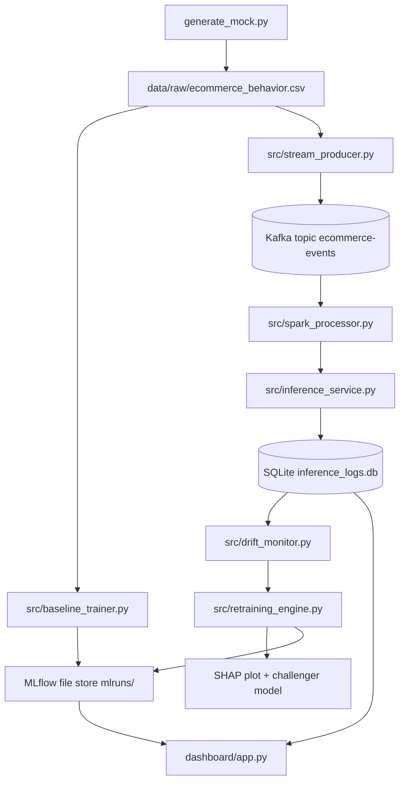

# ARES: Autonomous Machine Learning Reliability Platform

ARES is an end-to-end streaming fraud demo that shows how an ML system can ingest live events, score them with a production model, detect drift, retrain a challenger model, generate SHAP explanations, and keep serving traffic while the model rotates.

The project is designed as a demo of an autonomous self-healing ML pipeline, not a production fraud platform. The emphasis is on observability, drift response, and controlled model replacement.

## What This Project Does

ARES simulates a retail transaction pipeline with the following loop:

1. Generate a rich synthetic ecommerce dataset.
2. Push those rows into Kafka as a live event stream.
3. Consume the stream with Spark and forward each event to a FastAPI inference service.
4. Score each event with the current MLflow-backed production model.
5. Log every inference to SQLite.
6. Monitor the recent stream for drift using PSI.
7. Trigger retraining when drift crosses a threshold.
8. Compare champion vs challenger performance.
9. Log SHAP plots and rotate the model if the challenger wins.
10. Reflect the entire process in a Streamlit dashboard.

The demo is intentionally visible and procedural so you can explain every stage while presenting it.

## High-Level Architecture



The important idea is that the stream is not just “data in, prediction out.” The inference service writes every scored event to SQLite, the drift monitor reads those logs, and retraining uses the same logged data to decide whether the production model should change.

## Repository Layout

```text
ARES2.0/
├── generate_mock.py          # Creates the baseline synthetic ecommerce dataset
├── reset_demo.sh             # Clears state so the demo starts cleanly
├── docker-compose.yml        # Starts Kafka and Zookeeper
├── dashboard/
│   └── app.py                # Streamlit live operations dashboard
├── data/                     # Raw data, SQLite logs, SHAP plots
├── mlruns/                   # Local MLflow tracking store
└── src/
    ├── feature_schema.py     # Shared feature list and encoding helpers
    ├── baseline_trainer.py   # Trains the initial production model
    ├── stream_producer.py    # Publishes the synthetic stream to Kafka
    ├── spark_processor.py    # Reads Kafka and forwards events to inference
    ├── inference_service.py  # Scores events and logs them to SQLite
    ├── drift_monitor.py      # Calculates PSI and triggers retraining
    └── retraining_engine.py   # Builds challenger model, SHAP, and rotation
```

## Data Model

The demo now uses a richer synthetic ecommerce schema instead of a toy 4-column table. The shared model schema lives in [src/feature_schema.py](src/feature_schema.py) and includes:

- Transaction identity: `user_id`, `product_id`
- Purchase context: `event_type`, `category`, `device_type`, `channel`, `country`, `shipping_speed`
- Behavioral signals: `session_duration`, `cart_size`, `hour_of_day`, `is_weekend`
- Risk signals: `account_age_days`, `prior_orders`, `prior_chargebacks`, `discount_pct`, `merchant_risk_score`, `is_high_value`
- Target label: `is_fraud`

This matters because the model is no longer learning from one obvious fraud rule like “price over X means fraud.” It now sees a mixture of correlated signals, which gives the drift monitor and SHAP explanation more realistic behavior.

## How the System Works

### 1. Dataset generation

[generate_mock.py](generate_mock.py) creates 60,000 synthetic ecommerce records. The data is intentionally richer than the original version and includes realistic structure:

- event timings generated over a simulated timeline
- multiple product categories with different price bands
- user behavior variations like session length and cart size
- risk-related fields like prior chargebacks and merchant risk score
- a fraud target created from a noisy combination of those signals

The result is a dataset that is harder to solve with a trivial rule, which makes the demo more interesting and more explainable.

### 2. Baseline model training

[src/baseline_trainer.py](src/baseline_trainer.py) loads the generated CSV, encodes the shared features, splits the data, trains an XGBoost model, and logs the run to MLflow.

The baseline model is the initial production model. The inference service loads it from MLflow at startup.

Because MLflow 3 requires an explicit opt-in for file-backed tracking, the trainer uses:

```bash
MLFLOW_ALLOW_FILE_STORE=true python src/baseline_trainer.py
```

That writes the model to the local `mlruns/` directory.

### 3. Streaming simulation

[src/stream_producer.py](src/stream_producer.py) reads the synthetic CSV row by row and publishes each row as JSON to Kafka.

The producer does two important things:

- It sends a normal baseline stream most of the time.
- It periodically injects a drift regime by changing several correlated fields together, not just price.

That drift regime is what gives the PSI monitor something meaningful to detect.

### 4. Stream processing

[src/spark_processor.py](src/spark_processor.py) consumes the Kafka topic and forwards each record to the inference API.

Spark is not doing ML here; it is acting as the streaming bridge between Kafka and the scoring API. The micro-batch processor gives the demo a realistic “streaming architecture” feel while keeping the logic understandable.

### 5. Inference service

[src/inference_service.py](src/inference_service.py) is a FastAPI app that:

- loads the latest finished MLflow model from `mlruns/`
- encodes the incoming request with the shared feature schema
- predicts fraud probability
- logs the full event into SQLite

The inference database is the heartbeat of the rest of the system. Both the drift monitor and the dashboard read from it.

### 6. Drift monitoring

[src/drift_monitor.py](src/drift_monitor.py) periodically reads the latest rows from SQLite and compares them against the baseline dataset.

It currently monitors several fields, not just one:

- `price`
- `discount_pct`
- `session_duration`
- `merchant_risk_score`

It computes PSI for each feature and averages the result. If the PSI rises above the threshold, it inserts a retraining job into SQLite and spawns the retraining engine as a background process.

### 7. Retraining and model rotation

[src/retraining_engine.py](src/retraining_engine.py) is the self-healing part of the demo.

It performs these steps:

1. Load the current champion model from MLflow.
2. Pull the latest inference rows from SQLite.
3. Build a retraining dataset from the live drifted window.
4. Generate a SHAP summary plot for the current champion.
5. Split the data into train and validation sets.
6. Train a challenger model.
7. Evaluate champion vs challenger.
8. If needed, retrain more aggressively and compare again.
9. If the challenger wins, log it back to MLflow as the new production model.

If the live batch collapses into a one-sided label window, the retrainer now builds a balanced fallback target and chooses the best validation threshold for F1. That avoids the zero-F1 problem you saw in earlier runs.

### 8. Dashboard

[dashboard/app.py](dashboard/app.py) reads from SQLite and MLflow and displays:

- total streamed transactions
- current production model version
- recent high-risk transactions
- live probability scatter plots
- retraining job status
- SHAP plot output when available

The dashboard is deliberately chatty so it works well as a live demo screen.

## Runtime Sequence

The system is meant to be started in a specific order.

### Step 1: Start Kafka and Zookeeper

```bash
docker compose up -d
```

This launches the message broker layer used by the producer and Spark consumer.

### Step 2: Reset the demo state

```bash
./reset_demo.sh
```

This clears:

- `data/inference_logs.db`
- SHAP images in `data/`
- Spark checkpoints
- local MLflow artifacts
- Kafka volumes

Use this before a demo so the screen starts from a clean baseline.

### Step 3: Regenerate the dataset

```bash
python generate_mock.py
```

If your shell does not default to the intended Python environment, use the Miniforge interpreter explicitly:

```bash
/home/eidolon/miniforge3/bin/python generate_mock.py
```

### Step 4: Train the baseline model

```bash
MLFLOW_ALLOW_FILE_STORE=true /home/eidolon/miniforge3/bin/python src/baseline_trainer.py
```

This creates the initial MLflow run and produces the baseline production model.

### Step 5: Start the inference API

```bash
/home/eidolon/miniforge3/bin/python -m uvicorn src.inference_service:app --host 0.0.0.0 --port 8000
```

This loads the latest finished model from MLflow and opens the `/predict` endpoint.

### Step 6: Start Spark streaming

```bash
/home/eidolon/miniforge3/bin/python src/spark_processor.py
```

Spark will wait for Kafka events and forward each record to the inference API.

### Step 7: Start the stream producer

```bash
/home/eidolon/miniforge3/bin/python src/stream_producer.py
```

This begins publishing synthetic ecommerce events to Kafka.

### Step 8: Start drift monitoring

```bash
/home/eidolon/miniforge3/bin/python src/drift_monitor.py
```

Once enough inference rows exist, the PSI monitor begins checking for drift.

### Step 9: Start the dashboard

```bash
streamlit run dashboard/app.py
```

Open the Streamlit page in your browser and keep it visible during the demo.

## What Happens During a Normal Run

When all services are running correctly, the flow looks like this:

1. The producer writes events to Kafka.
2. Spark reads those events and sends them to FastAPI.
3. FastAPI scores each event with the current champion model.
4. Inference logs are stored in SQLite.
5. The dashboard updates the live transaction count and risk metrics.
6. The drift monitor keeps comparing the live window to the baseline.
7. If the drift stays below threshold, the champion model remains active.

## What Happens When Drift Is Detected

When the producer enters a drift window, the live data distribution changes across multiple fields.

The monitor then:

1. Calculates PSI on the most recent inference window.
2. Raises an alert when PSI exceeds the threshold.
3. Inserts a retraining job into SQLite.
4. Spawns the retraining engine in the background.
5. Generates a SHAP plot from the current champion.
6. Trains and evaluates the challenger.
7. Rotates the challenger into MLflow if it performs better.
8. Leaves the inference service running throughout the entire process.

That last point is the core of the demo: the system keeps serving predictions while the model is being evaluated and possibly replaced.

## Important Files to Know

- [generate_mock.py](generate_mock.py) creates the raw dataset.
- [src/feature_schema.py](src/feature_schema.py) defines the shared feature set.
- [src/baseline_trainer.py](src/baseline_trainer.py) trains the initial model.
- [src/stream_producer.py](src/stream_producer.py) simulates the live event stream.
- [src/spark_processor.py](src/spark_processor.py) bridges Kafka to the API.
- [src/inference_service.py](src/inference_service.py) serves predictions and logs them.
- [src/drift_monitor.py](src/drift_monitor.py) detects concept drift.
- [src/retraining_engine.py](src/retraining_engine.py) runs SHAP and retraining.
- [dashboard/app.py](dashboard/app.py) shows the live command center.

## Troubleshooting

### `generate_mock.py` says command not found

Run it with Python:

```bash
/home/eidolon/miniforge3/bin/python generate_mock.py
```

### MLflow complains about file store mode

Use the environment flag when training:

```bash
MLFLOW_ALLOW_FILE_STORE=true /home/eidolon/miniforge3/bin/python src/baseline_trainer.py
```

### Spark starts but the dashboard stays empty

Check that all of these are running:

- Kafka and Zookeeper from Docker
- `src/inference_service.py`
- `src/spark_processor.py`
- `src/stream_producer.py`

The dashboard depends on SQLite rows being written by the inference service.

### No retraining job appears

That usually means one of these is true:

- not enough inference rows exist yet
- drift has not crossed the PSI threshold
- the producer is not running long enough to enter a drift window

### SHAP image is missing

The retraining engine only saves SHAP output after a drift event produces enough rows for retraining. Let the stream run longer and watch the drift monitor console.

## Demo Tips

- Start the dashboard last so it opens on a populated backend.
- Keep the producer and Spark terminal visible during the presentation.
- If you want to force a visible retraining cycle, let the stream run long enough to enter the drift window.
- Reset the demo before presenting so the counters and MLflow state are clean.

## Notes On Design Choices

The main reason the demo now works better is that the synthetic data is no longer trivial:

- fraud is not determined by price alone
- drift changes multiple correlated fields at once
- the retrainer can recover even when the live label window is skewed
- all services share the same feature schema

That makes the pipeline easier to explain and much harder to dismiss as a toy example.
