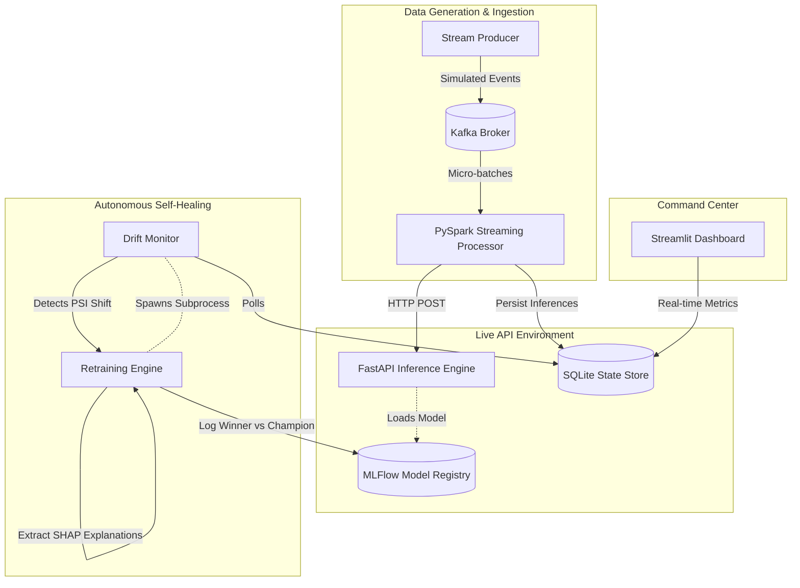

# ARES 2.0: Autonomous Machine Learning Reliability Platform

ARES (Autonomous Reliability Engine System) is an end-to-end event streaming and self-healing machine learning architecture. It continuously ingests realtime data, evaluates transactions using an active production model, detects concept drift (Dataset Shift) on-the-fly, and automatically rotates model versions with zero API downtime when data distributions shift.

## Architectural Overview

ARES is composed of six fully decoupled microservices operating asynchronously.



## Core Components

1. **Stream Producer** (`src/stream_producer.py`)
   Simulates live e-commerce traffic, pushing JSON payloads to a Kafka topic. It includes a built-in "Concept Drift Burst" feature that cyclicly manipulates event pricing schemas to deliberately crash the incumbent Champion model and trigger the ARES self-healing system.

2. **Stream Processor** (`src/spark_processor.py`)
   Consumes the Kafka topic via PySpark Structured Streaming. Operates under a micro-batch execution scheme, pushing events sequentially to the live REST API and checkpointing progress safely.

3. **Inference Engine** (`src/inference_service.py`)
   A highly concurrent FastAPI application that loads the active XGBoost model directly from the MLflow artifact registry. It intercepts incoming transactions, executes statistical predictions, and logs the evaluation traces to the local SQLite database via WAL mode.

4. **Drift Monitor** (`src/drift_monitor.py`)
   A lightweight polling daemon that constantly measures the Population Stability Index (PSI) of the incoming distribution against a static expected baseline. If PSI exceeds `0.20`, it triggers an asynchronous pipeline rotation.

5. **Retraining Engine** (`src/retraining_engine.py`)
   Triggered selectively by the Drift Monitor, this heavy-compute script executes SHAP diagnostic generation and trains a Challenger XGBoost model. It rigidly assesses the Challenger's F1 score against the incumbent Production Model. If the Challenger outperforms, it logs the new model directly to MLflow, establishing a new production tag for zero-downtime hot-swapping.

6. **Command Center** (`dashboard/app.py`)
   An executive Streamlit observation dashboard providing live visualizations of system metrics, current active models, automated retraining workflow states, and root-cause diagnostic visualizations for detected dataset anomalies.

## Execution Requirements

Before executing the ARES pipeline, ensure the following requirements are fulfilled:
- Python 3.11+
- Apache Spark (PySpark)
- Docker Desktop (for Kafka & Zookeeper)

## Execution Sequence

For a successful presentation or full end-to-end execution, initiate the modules in the exact sequence outlined below using distinct terminal instances.

**Step 1: Wiping Residual State**
```bash
./reset_demo.sh
```
This purges historical MLflow tracking data, PySpark caching locators, Kafka Docker volumes, and existing SQLite records to ensure a pristine start.

**Step 2: Stream Initialization**
```bash
python src/stream_producer.py
```
This forces Kafka to securely register the required topics prior to consumer startup. Leave this script executing permanently.

**Step 3: Web Server Boot**
```bash
uvicorn src.inference_service:app --host 0.0.0.0 --port 8000
```
This brings the REST API online. It will initially load the `Initial Baseline` model from MLflow.

**Step 4: PySpark Sync**
```bash
python src/spark_processor.py
```
Establishes the link between the Kafka queue and the REST API. You will see inferences actively logging to the console.

**Step 5: Background Monitoring**
```bash
python src/drift_monitor.py
```
Initiates real-time PSI calculation.

**Step 6: Dashboard Observation**
```bash
streamlit run dashboard/app.py
```

## Behavior During Drift

When `stream_producer.py` hits its internal dynamic threshold, it will rapidly flood the system with manipulated records. 

1. The Fast API will continue scoring them efficiently.
2. The Streamlit Dashboard will aggressively indicate the volume of risky transactions.
3. The Drift Monitor will warn that the distribution PSI > 0.20 and spawn a background process.
4. The Streamlit Dashboard will display the active pipeline progress (SHAP generation -> Challenger Compilation -> Comparison).
5. Upon successful evaluation, MLflow automatically rotates the production tags.
6. The REST API seamlessly pulls the newly rotated MLflow tag on the sub-sequent payload.
