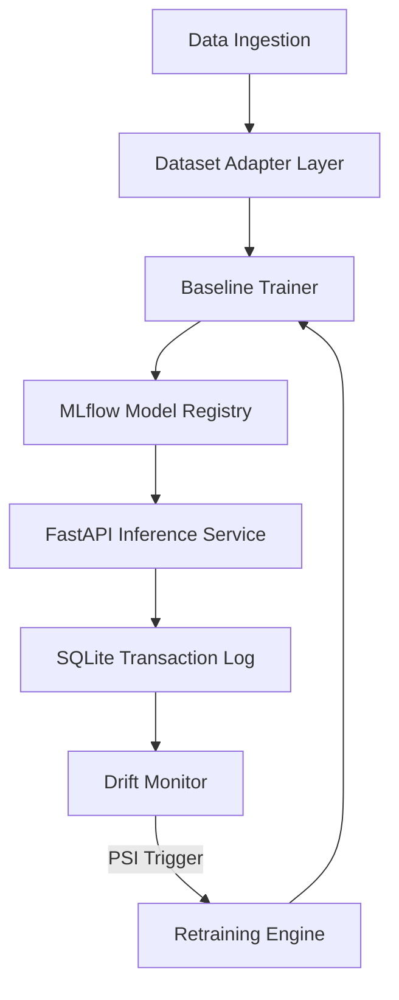

# ARES: Autonomous Machine Learning Reliability Platform

ARES is an end-to-end autonomous ML reliability and closed-loop recovery platform designed to detect and heal model concept drift in real-time without service downtime.

---

## 1. Problem
Production ML models degrade over time due to **concept drift** (changes in environment dynamics, user behavior, or label boundaries). Traditional monitoring tools only alert engineers, leaving a critical window of exposure where the model makes incorrect, high-risk predictions before manual retraining and redeployment can occur.

---

## 2. Solution
ARES automates the entire drift lifecycle. It continuously scores transactions, monitors feature stability using statistical markers, schedules out-of-band retraining when drift is detected, optimizes decision thresholds, and hot-swaps active production models dynamically.

---

## 3. Architecture
ARES utilizes a decoupled architecture where the low-latency API serving layer is isolated from background drift telemetry and model optimization engines.



For detailed component flow charts and sequence diagrams, see [docs/diagrams/mermaid_diagrams.md](docs/diagrams/mermaid_diagrams.md).

---

## 4. Key Features
*   **Decoupled Serving & Telemetry**: FastAPI predicts in under 15ms while asynchronous monitors evaluate stability out-of-band.
*   **Statistical Drift Breakers**: Tracks Population Stability Index (PSI) and triggers alerts when PSI breaches `0.20`.
*   **Dynamic Imputation Adapter**: Standardizes incoming REST payloads, imputing raw feature vectors with baseline medians.
*   **Closed-Loop Retraining**: Out-of-band Retraining Engine compiles historical and drifted logs, trains a Challenger, and optimizes decision thresholds.
*   **Hot-Swapping Registry**: ModelManager fetches and updates active registry models in MLflow dynamically.
*   **SHAP Explainability**: Attributes feature importance shifts between Champion and Challenger models.
*   **Operations Console**: Multi-page Grafana-style dashboard for real-time telemetry audit.

---

## 5. Technology Stack
| Component | Technology |
| :--- | :--- |
| **API Serving** | FastAPI, Uvicorn |
| **Classifier** | XGBoost |
| **Tracking Registry** | MLflow |
| **Database** | SQLite3 |
| **Audit Dashboard** | Streamlit |
| **Explainability** | SHAP |
| **Infrastructure** | Docker-Compose |

---

## 6. Quick Start
1.  **Start Local Infrastructure**:
    ```bash
    docker compose up -d
    ```
2.  **Reset DB & Caches**:
    ```bash
    ./reset_demo.sh
    ```

---

## 7. One Command Demo
Run the entire end-to-end self-healing pipeline:
```bash
python demo.py
```
This single command:
1.  Verifies mock datasets and trains the baseline Champion model.
2.  Launches the background multi-scenario concept drift benchmark simulation.
3.  Launches the Streamlit Operations Console in the foreground.
4.  Terminates background jobs automatically on exit.

---

## 8. Benchmark Results
Evaluated across five independent probabilistic drift scenarios:

| Scenario | Drift Start | Detection Step | Latency | Peak PSI | Cycles | Challenger F1 |
| :--- | :---: | :---: | :---: | :---: | :---: | :---: |
| **Scenario A (Gradual Covariate Drift)** | 300 | 500 | 200 | 0.8880 | 1 | 0.9077 |
| **Scenario B (Sudden Covariate Drift)** | 300 | 500 | 200 | 1.9703 | 1 | 0.8060 |
| **Scenario C (Feature Distribution Drift)** | 300 | 500 | 200 | 0.8355 | 1 | 0.8766 |
| **Scenario D (Concept Drift)** | 300 | 500 | 200 | 2.9489 | 1 | 0.9379 |
| **Scenario E (Recurring Drift)** | 300 | 500 | 200 | 2.0705 | 2 | 0.9410 |

---

## 9. Dashboard
The multi-page Operations Console contains exactly six pages:
1.  **Overview**: Executive health status, active registry runs, and latest stability metrics.
2.  **Live System Demo**: Real-time pipeline workflow state visualizer tracking the current simulation stage.
3.  **Recovery Analytics**: Comparison of Champion vs Challenger performance and PSI trend lines.
4.  **Explainability**: SHAP attribution analysis before and after retraining.
5.  **MLflow**: Detailed experiment runs, parameters, metrics, and artifact references.
6.  **Documentation**: Quick references to internal documentation files.

---

## 10. Repository Structure
```text
ARES2.0/
├── demo.py                        # One-command demo entry point
├── reset_demo.sh                  # Utility script to clean DBs and MLflow logs
├── generate_mock.py               # Script to generate raw transactional dataset
├── docker-compose.yml             # Docker config for Kafka & Zookeeper
├── requirements.txt               # Package dependencies
├── LICENSE                        # MIT License
├── README.md                      # Project landing page (this file)
│
├── docs/                          # Core system documentation
│   ├── ARCHITECTURE.md            # Architecture specs and sequence flows
│   ├── TECHNICAL_DOCUMENTATION.md # Unified platform specifications
│   ├── LIMITATIONS.md             # Model assumptions and constraints
│   ├── BENCHMARKS.md              # Concept drift scenario methodology
│   ├── CLEANUP_REPORT.md          # Audit report of deleted files
│   └── RELEASE_CHECKLIST.md       # Release verification checklist
│
├── dashboard/                     # Multi-page Streamlit application
│   └── app.py
│
├── reports/                       # Generated benchmark evaluation artifacts
│   └── synthetic_platform_validation/ # Unified validation logs and curves
│
└── src/                           # Platform source modules
    ├── feature_schema.py          # Feature schema definition and encoding
    ├── baseline_trainer.py        # Champion baseline model trainer
    ├── inference_service.py       # FastAPI REST API serving prediction inputs
    ├── drift_monitor.py           # Stream monitoring and PSI alerts
    ├── retraining_engine.py       # Retraining process worker
    └── run_synthetic_benchmark.py # Multi-scenario drift validation benchmark suite
```

---

## 11. Future Work
*   **Dynamic Schema Registry**: Enable ingestion nodes to register custom schemas at runtime, bypassing constant median imputation.
*   **Probability Calibration**: Train Platt scaling / Isotonic Regression calibrators before registering models in MLflow.
*   **Real Streaming Pipelines**: Integrate direct Spark Structured Streaming consumers processing Kafka topics in production.

---

## 12. License
This project is licensed under the MIT License - see the LICENSE file for details.
