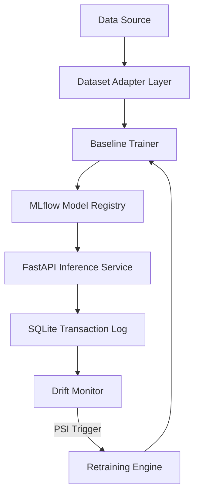

# ARES System Architecture

This document describes the design and technical architecture of the ARES ML Reliability platform. It outlines the components, data models, and workflow processes from data ingestion through inference serving, concept drift detection, automated retraining, and model deployment.

---

## 1. System Overview

ARES is a closed-loop autonomous ML reliability platform built for high-throughput, mission-critical fraud detection. It addresses model degradation caused by real-world concept drift by continuously monitoring streaming distributions, triggering retraining pipelines, and deploying validated challenger models.

---

## 2. Component Reference

### A. Ingestion and Adapters (`src/adapters/`)
*   **Role**: Converts arbitrary raw external datasets (e.g., IEEE-CIS, Synthetic) into the standard internal feature format.
*   **Design**: Inherits from a base `DatasetAdapter` class. It separates inputs into:
    *   `canonical_features`: Standardized operational features shared across models (e.g., `price`, `hour_of_day`, `device_type`).
    *   `predictive_features`: Raw, dataset-specific columns that maximize model accuracy (e.g., card counts, transaction codes).
*   **Outputs**: Returns an `AdapterOutput` containing the cleaned DataFrame, default feature medians for imputation, and feature column mapping configurations.

### B. Baseline Trainer (`src/baseline_trainer.py`)
*   **Role**: Handles offline model training, validation, hyperparameter optimization, and calibration.
*   **Key Algorithms**: Uses **XGBoost Classifier** with dynamic class weighting (`scale_pos_weight`) to balance fraud label distribution.
*   **Threshold Tuning**: Executes a grid search on a validation split to find the classification threshold that maximizes the F1-score.
*   **Logging**: Records all hyperparameters, metrics, artifacts (feature list JSONs, mappings, plots), and the trained XGBoost model run in **MLflow**.

### C. FastAPI Inference Service (`src/inference_service.py`)
*   **Role**: Serves live predictions via a standardized REST API.
*   **Model Manager**: Startup events fetch the active production model and its parameters directly from MLflow.
*   **Request Validation**: Enforces strict schema and data type checks using Pydantic models.
*   **Imputation Block**: Populates any dataset-specific raw features (e.g., `C1`, `D1` codes) missing from the standard API payload with default medians loaded from MLflow metadata.
*   **Event Logging**: Logs transaction metadata, features, model run version, latencies, and prediction probabilities to a local SQLite transaction log.

### D. Drift Monitor (`src/drift_monitor.py`)
*   **Role**: Tracks distribution shifts on live prediction streams.
*   **Metric**: Computes the **Population Stability Index (PSI)** on rolling window slices of streaming transaction price values compared against the baseline distribution.
*   **Trigger**: If the rolling PSI crosses a configured threshold (typically `0.20`), the monitor issues a high drift alert and invokes the retraining engine.

### E. Retraining Engine & Challenger Deployment
*   **Role**: Closes the loop by training a challenger model on drifted data.
*   **Process**:
    1.  Pulls the drifted transaction logs from the SQLite database.
    2.  Combines baseline records with drifted events, shuffling and partitioning the data into train, validation, and test splits.
    3.  Trains a **Challenger model** with calibrated classification thresholds.
    4.  Evaluates the challenger on the drifted held-out test split.
    5.  Logs the challenger run to MLflow and deploys the run ID, replacing the active model.

### F. Explainability and SHAP (`src/run_synthetic_benchmark.py`)
*   **Role**: Provides transparency for model audits during drift.
*   **Process**: Performs SHAP (SHapley Additive exPlanations) attributions on sample inputs before and after retraining. SHAP summary plots are saved under `reports/synthetic_platform_validation/` to visualize how decision parameters adapted to the drifted feature ranges.

---

## 3. Core Workflow

1.  **Ingestion & Training**: An adapter processes raw transaction tables. The trainer validates schemas, trains the champion model, calibrates thresholds, and uploads artifacts to MLflow.
2.  **Serving**: FastAPI loads the champion. Clients send Standard Inference payloads, missing columns are imputed with medians, and predicted probabilities are logged.
3.  **Drift Detection**: The drift monitor calculates the PSI on price values. If PSI $> 0.20$, retraining triggers.
4.  **Autonomous Recovery**: The retraining engine trains a challenger model, performs offline evaluations on held-out splits, uploads the model run, and updates the FastAPI active model manager.
