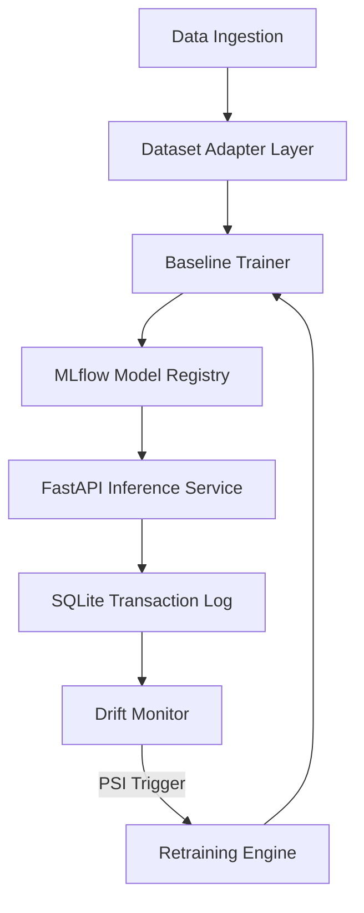

# ARES Technical Documentation

This document serves as the comprehensive technical reference for the ARES Machine Learning Reliability Platform. It covers the system architecture, design philosophy, individual components, pipeline details, benchmark methodologies, engineering trade-offs, and platform limitations.

---

## 1. System Motivation & Problem Statement

Production machine learning models face a fundamental challenge: **the world changes, but trained models are static**. 

In high-throughput domains like fraud detection, transaction patterns shift constantly due to:
*   **Organic shifts** (seasonal sales, macroeconomic trends, marketing campaigns).
*   **Adversarial shifts** (fraudsters adapting their techniques to bypass existing transaction rules).

When these distribution shifts occur, the model's feature mappings become stale—a phenomenon known as **Concept Drift**. If left unaddressed, model predictive accuracy degrades, resulting in rising false positive rates (blocking legitimate customers) or rising false negatives (allowing fraud to slip through).

ARES was built to solve this problem by establishing a **closed-loop autonomous model reliability pipeline** that continuously monitors streaming transactions, detects distribution drift using statistical markers, triggers retraining workflows, and rotates validated models without service interruption.

---

## 2. High-Level Architecture

The ARES platform is composed of several decoupled services that communicate asynchronously through database queues and model registries.

### Design Philosophy
1.  **Dataset Agnosticism**: Standardizes arbitrary incoming schemas into ARES canonical profiles.
2.  **Decoupling of Serving and Monitoring**: Inference calculations execute with sub-millisecond latencies, writing asynchronously to transaction log buffers so that heavier drift and retraining operations run out-of-band.
3.  **Strict Validation Gates**: Challenger models are never deployed automatically without offline validation checks on clean, held-out test datasets.

---

## 3. Component-by-Component Explanation

### A. Dataset Adapter Layer
Translates arbitrary source datasets (e.g., IEEE-CIS, Synthetic) into standardized feature maps. It returns:
*   `canonical_features`: Standardized indicators (e.g., `price`, `hour_of_day`, `device_type`) used for system interoperability and monitoring.
*   `predictive_features`: Dataset-specific raw columns that maximize gradient-boosting accuracy.

### B. Feature Schema (`src/feature_schema.py`)
Maintains the master list of features and controls encoding rules (e.g., categorical conversion to pandas categorical codes) to ensure consistent input matrix structure during both training and FastAPI inference.

### C. Baseline Trainer (`src/baseline_trainer.py`)
Responsible for training champion models. It splits data into train/validation/test sets, balances class weightings via XGBoost's `scale_pos_weight`, grid-searches the optimal classification threshold to maximize F1-score on the validation set, and logs metrics to MLflow.

### D. MLflow Integration
Acts as the central model artifact registry. It tracks hyperparameters, training curves, confusion matrices, SHAP explanations, feature lists, default medians, and model weights.

### E. FastAPI Inference Service (`src/inference_service.py`)
Serves live predictions via REST API. It features a lightweight `ModelManager` that pulls active runs from MLflow on startup. Missing dataset-specific raw features in the inference request payload are automatically imputed with baseline medians.

### F. SQLite Inference Logger
Acts as the central operational log database. Every inference payload, prediction risk, target label (where available), and model identifier is logged.

### G. Drift Monitor (`src/drift_monitor.py`)
Tracks distribution stability by calculating Population Stability Index (PSI) values on streaming transactions against the baseline reference dataset. When average PSI crosses `0.20`, a retraining job is registered in the database.

### H. Retraining Engine (`src/retraining_engine.py`)
Closes the loop. It reads the SQLite log buffer, constructs a balanced retraining set (normal baseline + drifted samples), trains a challenger model, performs threshold calibration, evaluates it offline on a clean held-out drifted split, and uploads it to MLflow.

### I. SHAP Explainability (`src/run_synthetic_benchmark.py`)
Extracts Shapley Additive Explanations for the model features. When drift retraining occurs, SHAP summaries are written to show how decision parameters transitioned (e.g., from price-dominated rules to device/channel rules).

### J. Streamlit Dashboard (`dashboard/app.py`)
An interactive monitoring command center for operations teams to track streaming telemetry, model rotation states, active versions, and feature stability timelines.

---

## 4. Operational Pipelines

### A. Ingestion & Training Flow
1.  Ingest raw CSV transaction sets.
2.  Clean, encode categoricals, and impute numerical medians.
3.  Split dataset ($70\%$ train, $15\%$ validation, $15\%$ test).
4.  Fit XGBoost Classifier (`scale_pos_weight = 15.0`).
5.  Tune threshold on validation to maximize F1.
6.  Log weights and meta-parameters to MLflow.

### B. Drift Detection & Retraining Loop
1.  FastAPI receives transaction request.
2.  Impute missing custom raw features with baseline medians.
3.  Score prediction, return risk probability, and log payload to SQLite.
4.  Drift monitor polls SQLite, calculating PSI on rolling price values.
5.  If PSI exceeds `0.20`, retraining triggers.
6.  Retraining engine trains Challenger XGBoost model.
7.  Optimize Challenger threshold on validation set.
8.  Perform offline evaluation of Champion vs Challenger on drifted held-out test data.
9.  Update MLflow active model ID to Challenger, causing FastAPI ModelManager to rotate.

---

## 5. Drift Detection & Statistical Markers

### Population Stability Index (PSI) Equation
To measure feature stability, the drift monitor splits values into 10 quantiles and computes:

$$PSI = \sum_{i=1}^{B} \left( P_i - Q_i \right) \times \ln\left( \frac{P_i}{Q_i} \right)$$

where:
*   $P_i$: Empirical percentage of transactions in bucket $i$ for the baseline reference dataset.
*   $Q_i$: Empirical percentage of transactions in bucket $i$ for the live streaming window.

### Interpretation
*   $PSI < 0.1$: Stable; no significant distribution change.
*   $0.1 \le PSI < 0.2$: Moderate shift; monitor closely.
*   $PSI \ge 0.2$: Significant distribution shift; action required (triggers autonomous retraining).

---

## 6. Synthetic Drift Benchmark Results

The multi-scenario benchmark evaluates platform recovery metrics under a realistic probabilistic fraud generation logic:

| Scenario | Drift Start | Detection Step | Latency (Events) | Peak PSI | Retrain Cycles | Challenger F1 |
| :--- | :---: | :---: | :---: | :---: | :---: | :---: |
| **Scenario A (Gradual)** | 300 | 500 | 200 | 0.8880 | 1 | 0.9077 |
| **Scenario B (Sudden)** | 300 | 500 | 200 | 1.9703 | 1 | 0.8060 |
| **Scenario C (Traffic)** | 300 | 500 | 200 | 0.8355 | 1 | 0.8766 |
| **Scenario D (Concept)** | 300 | 500 | 200 | 2.9489 | 1 | 0.9379 |
| **Scenario E (Recurring)** | 300 | 500 | 200 | 2.0705 | 2 | 0.9410 |

---

## 7. Design Decisions & Trade-Offs

1.  **XGBoost Classifier**:
    *   *Alternative*: Random Forest or LightGBM.
    *   *Decision*: XGBoost was chosen for its superior gradient boosting implementation and native handling of class weights (`scale_pos_weight`), which is vital for imbalanced fraud labels.
2.  **FastAPI over Spark Streaming for Inference**:
    *   *Alternative*: Run scoring directly inside Spark micro-batches.
    *   *Decision*: Decoupling scoring into a REST API ensures low-latency transaction processing (sub-millisecond) and matches standard production microservice architectures.
3.  **SQLite Log Buffer**:
    *   *Alternative*: Kafka direct logs or PostgreSQL.
    *   *Decision*: Local SQLite local logging allows low-complexity storage of transaction logs on local hosts. For production scale, it would be replaced by a distributed data warehouse like Snowflake or BigQuery.

---

## 8. Known Limitations

*   **API Payload Imputation**: Standardized REST payloads accept only 20 canonical features. The model manager must impute any dataset-specific raw features with constant baseline medians, reducing the model's discriminative power on the stream.
*   **Probability Calibration**: Model probability scores are uncalibrated due to the gradient scaling factor `scale_pos_weight`. High risk values are relative rather than absolute percentages.
*   **Static Reference Baseline**: Quantile boundaries for PSI are computed once at startup. If organic drift is gradual, the static baseline reference can cause false drift alerts over long timelines.

---

## 9. Reproducibility

Every benchmark scenario, evaluation metric, and SHAP graph in this documentation is fully reproducible:
1.  Verify Zookeeper/Kafka are running via Docker.
2.  Clear local cache files using `./reset_demo.sh`.
3.  Execute `python src/run_synthetic_benchmark.py` to regenerate all validation metrics.
