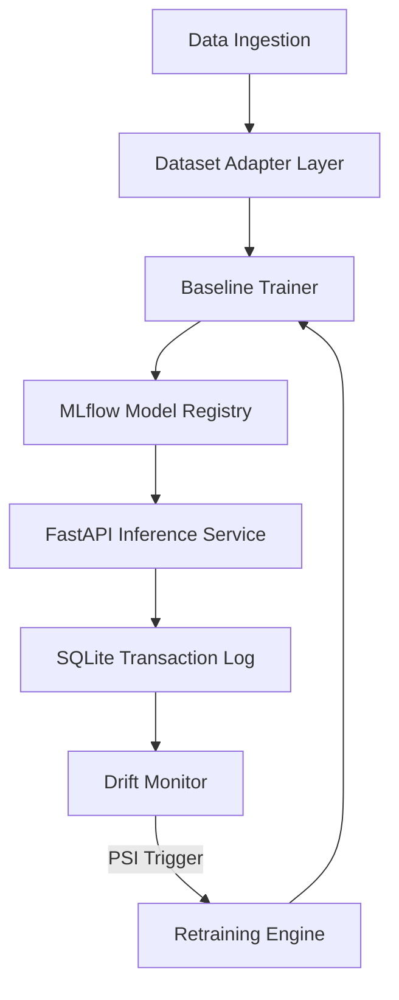
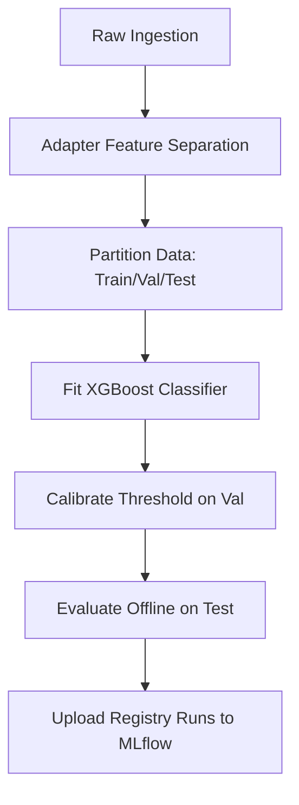
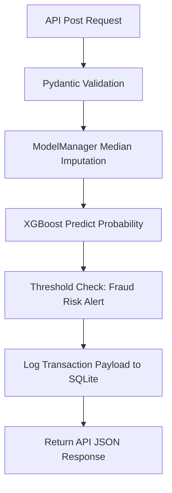
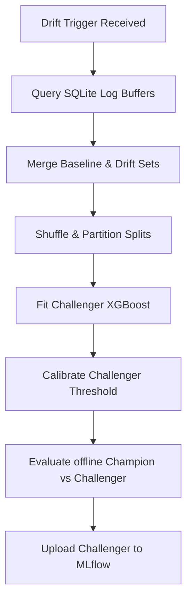
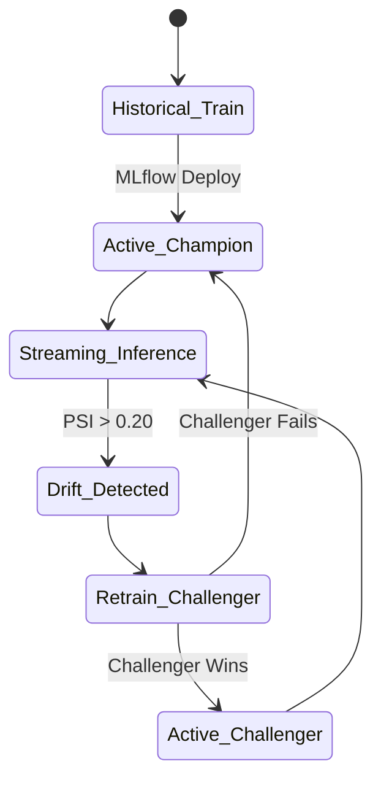
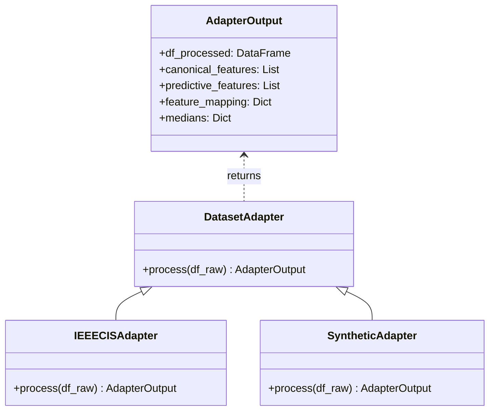
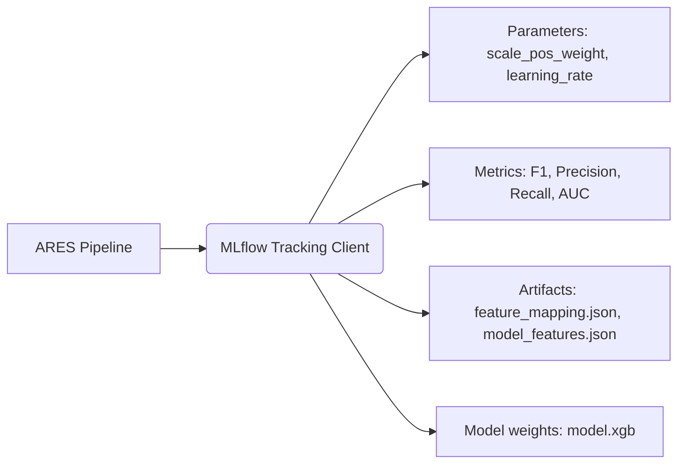
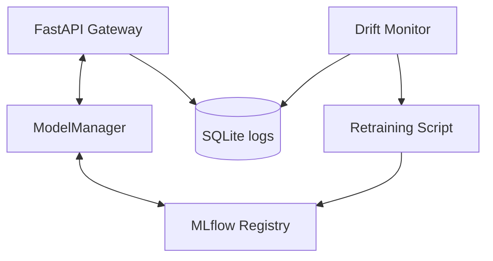
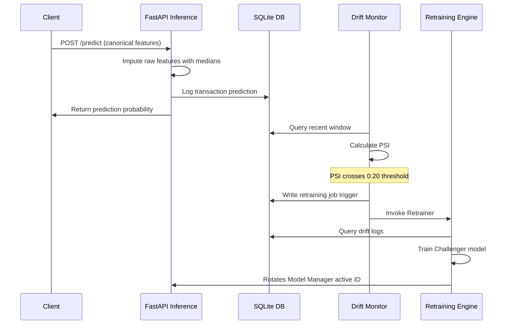

# ARES Mermaid System Diagrams

This document contains polished Mermaid system architecture and flow diagrams representing the ARES ML Reliability Platform.

---

## 1. Overall System Architecture


---

## 2. Training Pipeline


---

## 3. Inference Pipeline


---

## 4. Drift Detection Pipeline

```mermaid
flowchart TD
    A[Streaming Logs Ingested] --> B[Sliding Window Ingestion]
    B --> C[Quantile Binning against Reference]
    C --> D[Compute Population Stability Index]
    D --> E{PSI > 0.20?}
    E -- Yes --> F[Register Retraining Job in SQLite]
    E -- No --> G[Continue Stream Monitoring]
```


---

## 5. Retraining Pipeline


---

## 6. Model Lifecycle


---

## 7. Dataset Adapter Architecture


---

## 8. MLflow Integration


---

## 9. Component Interaction


---

## 10. Sequence Diagram


---

## 11. Deployment Diagram
```mermaid
flowchart TD
    subgraph Client App
        A[Transaction Initiator]
    subgraph FastAPI Container
        B[REST Scoring Gateway]
    subgraph SQLite Instance
        C[(inference_logs.db)]
    subgraph MLflow Server
        D[Run Directory store]
    
    A -->|HTTP POST| B
    B -->|Logs evaluations| C
    B -->|Pulls active run| D
```
